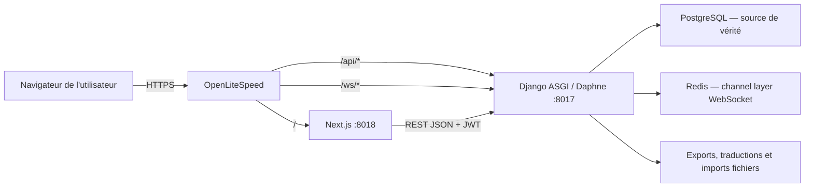
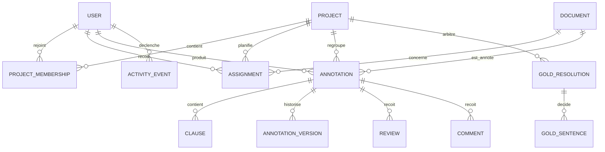
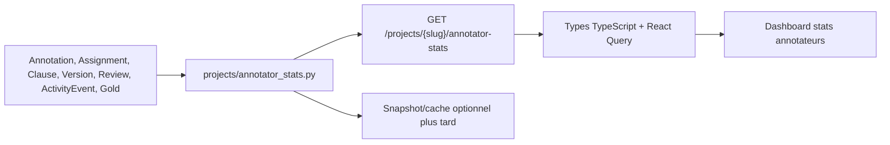

# Audit de CLAIRE Studio — architecture, annotation, statistiques et déploiement

> Audit réalisé le 22 juillet 2026 sur la branche `main`, commit `af84cf3`.
> Ce document distingue l'implémentation observée dans le code des intentions décrites dans
> `dossier/` et `docs/`. Il prépare l'ajout de statistiques liées aux annotateurs ; il ne constitue
> pas encore une spécification fonctionnelle de ces futures statistiques.
>
> **Mise à jour après audit :** les lacunes objectives du socle ont fait l'objet du plan et des
> corrections consignés dans `docs/PLAN_REMEDIATION_SOCLE_STATS_DEPLOIEMENT.md`. Les constats
> ci-dessous restent la photographie initiale ; le plan de remédiation indique leur état corrigé.

## 1. Synthèse

CLAIRE Studio est une application d'annotation juridique collaborative, organisée autour d'une
API Django/DRF et d'un frontend Next.js. PostgreSQL est la source de vérité en production ; SQLite
est utilisé localement. Le cœur du modèle est une session `Annotation` unique pour le triplet
`(projet, document, annotateur)`, contenant des `Clause` ancrées sur des phrases.

Le socle statistique actuel est déjà significatif :

- avancement par campagne et par annotateur ;
- accord inter-annotateurs par paire et par document avec κ de Cohen ;
- κ global, κ par thème et κ des frontières ;
- α de Krippendorff-MASI pour les annotations multi-label ;
- concordance d'un annotateur avec les pré-annotations LLM ;
- proximité de chaque annotateur avec le gold décidé.

En revanche, les statistiques individuelles de production ou d'effort décrites dans la
documentation — vélocité, temps de cycle, profondeur d'édition, activité quotidienne — ne sont pas
encore calculables de manière fiable. `ActivityEvent` journalise la création, les transitions de
statut, les versions et les verrous, mais pas chaque création/modification/suppression de clause.
Il n'existe pas non plus d'`AnalyticsSnapshot`, de pipeline Prometheus/Grafana ni de service
d'agrégation des métriques annotateur dans le code actuel.

Le déploiement de production réellement exploitable repose sur Git, SSH, systemd, Daphne, Next.js,
PostgreSQL, Redis et OpenLiteSpeed. Le chemin Docker/CI n'est pas fiable en l'état : les Dockerfiles
annoncés n'existent pas et les workflows GitHub Actions ciblent encore un ancien répertoire
`annotation-studio/`. Le script `deploy/deploy-claire.sh` est opérationnel dans son intention, mais
son rollback ne restaure pas la base après une migration incompatible et son healthcheck final ne
valide que l'API, pas le frontend ni le WebSocket.

## 2. Cartographie du dépôt

| Zone | Rôle réel |
|---|---|
| `backend/` | API Django 5/DRF, modèles, règles métier, migrations et tests pytest |
| `frontend/` | Next.js 14 App Router, TypeScript, React Query, Zustand, Tailwind, Vitest et Playwright |
| `dossier/` | conception historique générale et source de vérité annoncée (`CONTRACT.md`) |
| `docs/pactiva/` | dossiers d'audit, décisions, plans et runbooks successifs par fonctionnalité |
| `deploy/` | provisioning VPS, unités systemd, reverse proxy OpenLiteSpeed, certificat et déploiement SSH |
| `scripts/` | lancement local, seed, orchestration Redis/REST/ASGI/frontend et E2E |
| `data/` | corpus, pré-annotations et traductions ; les données volumineuses sont ignorées par Git |
| `.github/workflows/` | CI et contrôle d'idempotence du seed, actuellement désalignés avec la racine du dépôt |

La documentation est riche mais cumulative. Certains documents représentent une cible ancienne ou
une option étudiée, pas l'état du code. Pour toute nouvelle fonctionnalité, l'ordre de confiance
recommandé est :

1. modèles et migrations Django ;
2. services/vues/tests backend ;
3. contrat TypeScript, endpoints/hooks et composants frontend ;
4. documentation récente correspondant aux mêmes fichiers ;
5. documents historiques de `dossier/`.

Exemples de divergences observées :

- `dossier/06_collaboration_versioning/07_analytics_screen.md` prévoit des
  `AnalyticsSnapshot`, absents du code ; les endpoints `insights` recalculent actuellement les
  agrégats directement depuis la DB ;
- `dossier/11_tracking_observability/` décrit Prometheus, OpenTelemetry et Grafana, mais ces
  dépendances et endpoints ne sont pas implémentés ;
- des documents gold plus anciens font entrer les LLM dans la pondération de décision, alors que le
  moteur actuel `projects/gold_scoring.py` réserve explicitement la décision aux humains et n'utilise
  les LLM qu'à titre indicatif ;
- le README mentionne parfois le port frontend 3000, alors que `package.json` et les scripts locaux
  utilisent principalement 3001.

## 3. Architecture d'exécution



### Backend

Le backend est découpé en apps Django par domaine :

- `accounts` : utilisateurs, rôles, authentification et préférences UI ;
- `corpora` : corpus, documents, phrases et labels CLAUDETTE de référence ;
- `schemes` : vocabulaire fermé, thèmes et natures juridiques ;
- `projects` : campagnes, membres, assignations, progression, IAA, concordance et gold ;
- `annotations` : sessions, clauses, multi-label, versions, verrouillage et machine à états ;
- `collaboration` : commentaires, reviews, liens de partage et présence WebSocket ;
- `imports` : pré-annotations LLM et normalisation ;
- `exports` : jobs et artefacts dérivés ;
- `gold` : résolutions, décisions par phrase, arbitrage et statistiques gold ;
- `audit` : journal append-only `ActivityEvent` ;
- `translations` : synchronisation des traductions ;
- `common` : permissions, pagination, exceptions, sécurité et logging.

L'API est agrégée sous `/api/v1` par `backend/config/api_urls.py`. Les noms Python en
`snake_case` sont convertis en `camelCase` sur le fil par `djangorestframework-camel-case`. Cette
conversion est importante pour tout nouvel endpoint : le backend doit rester idiomatique en
`snake_case`, et les types frontend doivent décrire le JSON reçu en `camelCase`.

### Frontend

Le frontend utilise :

- l'App Router de Next.js pour les routes ;
- React Query pour le cache et les mutations serveur ;
- Zustand pour l'état local du workspace et les préférences ;
- un client `fetch` JWT avec refresh transparent ;
- MSW pour le mode mock et les tests ;
- Vitest pour les tests unitaires/composants et Playwright pour l'E2E.

Le cœur produit est `AnnotationWorkspace`, sous `/annotate/[annotationId]`. Les écrans de pilotage
principaux sont :

- `/projects/[slug]` : dashboard campagne, progression, concordance et IAA ;
- `/projects/[slug]/docs` : documents et matrice des sessions ;
- `/projects/[slug]/insights` : exploration agrégée des annotations humaines ;
- `/projects/[slug]/gold` et `/gold/stats` : résolution et comparaison au gold ;
- `/admin/projects/[slug]` : administration des membres, assignations et avancement ;
- `/admin/audit` : événements métier.

## 4. Modèle de données utile aux statistiques



Les invariants structurants sont :

- une seule `Annotation` par `(project, document, annotator)` ;
- une seule `Clause` par `(annotation, anchor_sentence)` ;
- seul le propriétaire modifie le contenu de son annotation, même si un admin/reviewer peut la lire
  et la revoir ;
- une soumission crée une version immuable et verrouille la session ;
- les statuts d'`Assignment` sont dérivés de l'état réel de l'annotation par signaux ;
- les calculs IAA ne prennent en compte que les annotations soumises, en revue ou approuvées ;
- le gold est stocké séparément des annotations humaines afin de préserver les sources.

Ces invariants sont essentiels pour les futures statistiques : le grain naturel est généralement
`projet × annotateur`, puis `projet × annotateur × document`. Il ne faut pas compter les lignes
d'assignation comme des annotations ni mélanger les pré-annotations LLM aux sessions humaines.

## 5. Parcours fonctionnel de l'application

1. Un administrateur crée ou alimente un corpus et un schéma de labels.
2. Il crée une campagne (`Project`), ajoute des membres et affecte des documents.
3. L'annotateur ouvre une affectation ; une session `Annotation` est créée ou retrouvée.
4. Il pose ou modifie des clauses par phrase, éventuellement à partir d'une pré-annotation LLM.
5. L'autosave écrit les clauses de manière incrémentale et idempotente (`client_op_id`).
6. Tant que la session contient des clauses, l'assignation passe à `in_progress`.
7. La soumission valide la machine à états, crée un `ActivityEvent`, produit un snapshot
   `AnnotationVersion`, verrouille la session et marque l'assignation `done`.
8. Un reviewer peut commenter, noter et faire transiter la session sans modifier ses clauses.
9. Les annotations soumises alimentent l'IAA et le module gold.
10. Un arbitre décide le gold phrase par phrase ; ces décisions alimentent les statistiques de
    proximité au gold et les exports.

## 6. Statistiques déjà implémentées

| Capacité | Source/calcul | API | UI | Limites |
|---|---|---|---|---|
| Avancement campagne | documents distincts annotés/soumis/approuvés | `GET /projects/{slug}/progress` | dashboard projet | mesure par document, pas par charge réelle |
| Avancement annotateur | assignés, commencés, soumis, pourcentage | `GET /projects/{slug}/annotators-progress` | admin projet | réservé admin ; inclut actuellement tous les membres, dont reviewers |
| Matrice des sessions | assigné, statut, clauses, verrou par document/annotateur | `GET /projects/{slug}/documents` | liste documents/admin | données brutes, pas de séries temporelles |
| IAA global | moyenne des κ pairwise par document | `progress` et `/iaa` | `IaaDashboard`/onglet IAA | κ sur thèmes exacts par phrase |
| IAA segmentation | κ sur présence d'une frontière à chaque phrase | `progress.iaaDetail` | `IaaDashboard` | moyenne non pondérée des paires |
| IAA par thème | κ one-vs-rest + support | `progress.iaaDetail` | `IaaDashboard` | support cumulé sur les paires |
| IAA multi-label | α Krippendorff-MASI | `progress.iaaDetail.alphaMasi` | typé, affichage à confirmer selon écran | forward-fill des sets de thèmes |
| IAA paire/document | κ annotateur A↔B et nombre de phrases | `GET /projects/{slug}/iaa` | tableau/export CSV prévu et partiellement câblé | identités non pseudonymisées |
| Humain↔LLM | accord sur les phrases co-couvertes | `progress.concordance` | `ConcordancePanel` | seulement pour l'utilisateur courant |
| Insights corpus | documents, annotateurs, versions, certitude, thèmes | `GET /projects/{slug}/insights` | page insights | requêtes directes et quelques N+1 possibles ; une session représentative par document |
| Insights document | thèmes, certitude, commentaires, contributeurs | `GET /projects/{slug}/insights/{documentId}` | détail insights | clauses affichées depuis une seule annotation représentative |
| Annotateur↔gold | pourcentage d'accord sur phrases gold co-couvertes | `GET /projects/{slug}/gold/stats` | `GoldStatsPanel` | pas de matrice complète A↔A/A↔LLM malgré certains anciens specs |

### Méthodes statistiques actuelles

- **κ de Cohen** : accord observé corrigé de l'accord attendu, calculé paire par paire puis moyenné.
- **κ frontières** : même formule sur un vecteur booléen « début de clause à cette phrase ».
- **κ par thème** : classification one-vs-rest par thème.
- **α MASI** : mesure multi-annotateur adaptée aux ensembles de labels.
- **Concordance simple** : `matches / phrases co-couvertes`, utilisée pour humain↔LLM et
  annotateur↔gold. Ce n'est pas un κ.

Ces mesures ne doivent pas être confondues dans l'UI. Toute carte doit afficher la métrique, le
support `n`, le périmètre et le statut des annotations incluses.

## 7. Lacunes avant d'ajouter des statistiques d'annotateurs

### Données insuffisamment tracées

Le journal `ActivityEvent` contient aujourd'hui principalement :

- `annotation.created` ;
- `annotation.submitted`, `in_review`, `approved`, etc. ;
- `annotation.versioned` ;
- événements de verrouillage projet/session.

Les opérations `clause.added`, `clause.updated` et `clause.deleted` ne sont pas enregistrées. Les
métriques suivantes seraient donc trompeuses sans évolution du journal : profondeur d'édition,
volume d'actions, taux de correction d'un seed, activité journalière fine et temps actif.

Le temps de cycle brut `created_at → submitted` est calculable, mais il inclut les pauses longues et
ne mesure pas le temps effectivement travaillé. La documentation interdit à juste titre le tracking
des frappes, mouvements de souris ou focus de fenêtre. Il faut donc présenter ce délai comme un
temps calendaire de cycle, de préférence médian, et jamais comme du « temps passé ».

### Cohérence et performance

- `insights` agrège directement les tables et boucle sur les documents ; cela convient au volume
  actuel, mais nécessitera des annotations ORM et/ou snapshots à plus grande échelle.
- certaines métriques choisissent la première annotation d'un document comme représentante ; ce
  n'est pas approprié pour des statistiques par annotateur.
- les endpoints d'IAA recalculent les vecteurs à chaque requête ; il faudra profiler avant de mettre
  un rafraîchissement fréquent sur un dashboard.
- la DB SQLite locale auditée n'a pas toutes les migrations appliquées. Elle contient 100 annotations,
  3 321 clauses et 303 événements, mais il s'agit d'un état local de démonstration, pas d'une mesure
  de production.

### Confidentialité et finalité

La documentation prévoit pseudonymisation, k-anonymat et finalité qualité plutôt qu'évaluation RH,
mais le code de restitution actuel renvoie souvent `username` et `display_name`. Avant toute vue
comparative individuelle, il faut décider explicitement :

- qui voit ses propres statistiques ;
- qui voit les statistiques nominatives des autres ;
- quelles données un lead, reviewer, admin ou owner peut consulter ;
- si les classements sont réellement souhaités ;
- quel seuil minimal de support masque une métrique instable ou ré-identifiante ;
- quelle durée de conservation s'applique aux événements.

## 8. Architecture recommandée pour les futures statistiques

Pour une première version, ne pas créer immédiatement une nouvelle infrastructure analytique.
Conserver la DB comme source de vérité et ajouter une couche de service dédiée, testable et sans
logique métier dans la vue.



Structure conseillée :

- `backend/claire/projects/annotator_stats.py` : fonctions pures/ORM d'agrégation ;
- un serializer de réponse explicite avec version de métriques ;
- une action `annotator-stats` sur `ProjectViewSet`, protégée par rôle ;
- filtres bornés : période, annotateur, statut, document ;
- `frontend/src/types/contract.ts`, `endpoints.ts`, `hooks.ts` ;
- une page ou un onglet dédié, avec tableau accessible sous les graphiques ;
- tests de formule, permissions, isolation projet, requêtes et E2E.

Un snapshot matérialisé ou une tâche périodique ne devient utile que si les mesures montrent que les
agrégations à la demande sont trop lentes. Dans ce cas, stocker la version de formule, le périmètre,
`computed_at` et les clés d'invalidation ; ne jamais faire du snapshot la vérité primaire.

### Catalogue minimal proposé

| Métrique | Formule conseillée | Source disponible | Précaution |
|---|---|---|---|
| Affectations terminées | `done / assigned` | `Assignment.status` | exclure reviewer sans session |
| Sessions soumises | compte des statuts soumis/revue/approuvé | `Annotation.status` | afficher le dénominateur |
| Couverture | phrases ou clauses validées / phrases du périmètre | `Clause`, `Document` | choisir clairement phrase vs clause |
| Certitude moyenne | moyenne et distribution 0–3 | `Clause.certainty` | afficher les valeurs manquantes |
| Qualité de revue | score, approbations, demandes de changement | `Review` | support minimal ; pas de classement brut |
| Accord pairwise | κ par paire/document | service IAA existant | minimum 2 soumissions communes |
| Accord multi-label | α MASI | service IAA existant | expliquer la métrique |
| Proximité gold | accords / phrases gold co-couvertes | `gold.stats` | afficher `n` et couverture gold |
| Cycle calendaire | médiane `created_at → première soumission` | Annotation + événement | ne pas appeler « temps de travail » |
| Re-soumissions | nombre de versions de soumission | `AnnotationVersion` | distinguer snapshots manuels |

Les métriques d'édition détaillée doivent attendre l'ajout atomique des événements de clause, idéalement
dans la même transaction que la mutation, avec un payload minimal sans texte juridique.

## 9. Stratégie de tests pour la fonctionnalité stats

Les futurs tests doivent couvrir au minimum :

1. formules sur jeux synthétiques avec 0, 1, 2 et 3+ annotateurs ;
2. annotations non soumises exclues des mesures d'accord ;
3. distinction assigné/commencé/soumis ;
4. utilisateurs reviewer sans session exclus des dénominateurs d'annotation ;
5. valeurs nulles de certitude et supports nuls ;
6. isolation entre projets et permissions par rôle ;
7. pseudonymisation ou exposition nominative selon la décision produit ;
8. budget de requêtes ORM pour éviter les N+1 ;
9. compatibilité camelCase du contrat frontend ;
10. E2E du filtre, des états vides, du tableau accessible et de l'export.

Le contrôle ciblé réalisé pendant cet audit a passé 80 tests sur l'IAA, la concordance, le scoring
gold, l'API gold et la batterie multi-annotation. `manage.py check` ne signale aucune erreur. Une
seule alerte de dépréciation concerne `datetime.utcnow()` dans l'export gold.

## 10. Déploiement actuel

### Production observée dans `deploy/`

| Élément | Valeur/configuration |
|---|---|
| Domaine par défaut | `pactiva.legal` |
| Répertoire VPS | `/var/www/claire-studio` |
| Backend | service `claire-studio`, Daphne sur `127.0.0.1:8017` |
| Frontend | service `claire-studio-web`, Next.js sur `127.0.0.1:8018` |
| Proxy/TLS | OpenLiteSpeed + Let's Encrypt |
| DB | PostgreSQL `claire_studio`, rôle dédié `claire` |
| Temps réel | Redis DB 11 + Channels |
| Déploiement | push Git local, fetch/pull VPS, migrations, static, build, restart, healthcheck |

Le script `deploy/provision.sh` prépare le venv, PostgreSQL, `.env`, le seed, le build frontend et
les unités systemd. `deploy/ols-cert.sh` ajoute le virtual host avec sauvegarde et vérifie plusieurs
sites voisins avant/après émission du certificat. `deploy/push-preannotations.sh` transfère par
`rsync` les pré-annotations ignorées par Git puis lance l'import idempotent.

### Séquence de déploiement prévue par le dépôt

1. exécuter les tests backend et frontend en local ;
2. lire le SHA actuellement déployé sur le VPS ;
3. pousser la branche courante vers `origin` ;
4. sur le VPS : fetch, checkout, pull `--ff-only` ;
5. installer les dépendances backend ;
6. appliquer les migrations et `collectstatic` ;
7. installer/build le frontend ;
8. redémarrer les deux services systemd ;
9. vérifier `/api/v1/health` ;
10. si le healthcheck échoue, replacer le code au SHA précédent, rebuild et redémarrer.

### Risques et corrections à faire avant le prochain déploiement fonctionnel

1. **GitHub Actions désaligné** : les workflows utilisent `annotation-studio/backend` et
   `annotation-studio/frontend`, qui n'existent pas depuis la racine actuelle. Les caches ciblent
   aussi un `pnpm-lock.yaml` absent alors que le dépôt suit `package-lock.json`.
2. **Docker incomplet** : `docker-compose.yml` fait `build: ./backend` et `./frontend`, mais aucun
   Dockerfile n'est présent. Les jobs CI de build d'images échoueront.
3. **Rollback migration non garanti** : `git reset --hard PREV_SHA` restaure le code mais la commande
   `migrate` rejoue vers l'avant ; elle ne remet pas le schéma à l'état du SHA précédent. Toute
   migration destructive ou non rétrocompatible exige une stratégie expand/contract et un backup.
4. **Healthcheck trop étroit** : le script final ne contrôle que l'API. Ajouter au minimum la page
   frontend, une requête DB fonctionnelle et, si la fonctionnalité le touche, un smoke WebSocket.
5. **Tests conditionnels** : les tests backend sont silencieusement ignorés si le venv local n'existe
   pas ; le frontend suppose `node_modules` présent. Un déploiement doit échouer si le gate ne peut
   pas s'exécuter.
6. **Branche courante déployable sans garde** : le script pousse et déploie n'importe quelle branche.
   Ajouter une confirmation/allowlist (`main` ou branche release), un contrôle de worktree propre et
   la vérification que le SHA distant est exactement celui testé.
7. **Dépendances non verrouillées côté Python** : `requirements.txt` utilise des plages larges ; un
   déploiement peut installer une version différente de celle testée.
8. **Pas de sauvegarde DB dans le script** : effectuer un backup vérifié avant une migration à risque.
9. **État local non migré** : la DB SQLite locale auditée a plusieurs migrations en attente ; toujours
   exécuter `migrate` avant un test manuel représentatif.
10. **Secrets** : les fichiers `.env` et `.credentials/` n'ont volontairement pas été lus pendant
    l'audit. Ils sont ignorés par Git ; conserver cette discipline et ne jamais les afficher dans CI.

## 11. Flux Git/GitHub recommandé avec `gh`

Le remote configuré est `origin = https://github.com/elazharjebbari/claire-studio.git`, branche par
défaut locale `main`, actuellement alignée sur `origin/main` au commit audité. Le binaire `gh` n'est
pas installé dans l'environnement local au moment de l'audit.

Après installation et authentification de GitHub CLI, le flux conseillé pour chaque fonctionnalité
est :

```bash
gh auth login
git switch main
git pull --ff-only origin main
git switch -c codex/stats-annotateurs

# développement + migrations + tests
git status --short
git add <fichiers-validés>
git commit -m "feat(stats): ajoute les statistiques annotateurs"
git push -u origin codex/stats-annotateurs
gh pr create --draft --fill --base main

# après revue et CI verte
gh pr ready
gh pr checks --watch
gh pr merge --squash --delete-branch
```

Une fois `main` fusionnée et synchronisée localement, le déploiement VPS devrait idéalement cibler un
SHA immuable ou un tag, plutôt que « la branche courante » :

```bash
git switch main
git pull --ff-only origin main
git status --short
git rev-parse HEAD
./deploy/deploy-claire.sh
```

Avant d'utiliser ce dernier script, corriger le gate CI/local et valider la stratégie de migration.
Ne jamais utiliser `--no-tests` pour une fonctionnalité de statistiques touchant les formules, les
permissions ou le schéma.

## 12. Runbook de vérification post-déploiement des futures stats

Après le healthcheck générique :

1. vérifier les migrations (`showmigrations`) et les services systemd ;
2. ouvrir le dashboard avec un compte annotateur, un lead et un admin ;
3. vérifier qu'un utilisateur hors projet ne peut pas lire les stats ;
4. comparer un petit échantillon de résultats API à une requête DB de référence ;
5. vérifier les états sans données, support faible et 3+ annotateurs ;
6. contrôler les logs sans PII ni contenu de clauses ;
7. vérifier le frontend, l'API et le WebSocket si l'écran se rafraîchit en temps réel ;
8. surveiller latence et nombre de requêtes DB ;
9. confirmer que les écrans d'annotation, de soumission et de gold n'ont pas régressé ;
10. noter le SHA, l'heure, le résultat des smokes et la procédure de rollback applicable.

## 13. Décisions à prendre avant l'implémentation

Pour transformer cet audit en spécification, il faudra préciser :

- les utilisateurs cibles de l'écran : annotateur, lead, reviewer, admin ;
- les métriques exactes et leur finalité ;
- le niveau de détail : campagne, annotateur, document, thème, période ;
- l'affichage nominatif, pseudonymisé ou uniquement personnel ;
- les filtres, exports et comparaisons souhaités ;
- les seuils de support et règles de confidentialité ;
- la nécessité ou non de tracer les mutations de clauses ;
- le volume cible afin de choisir agrégation à la demande ou snapshots ;
- les critères d'acceptation et le protocole de validation métier.

## 14. Références prioritaires

- `backend/claire/projects/views.py` — endpoints projet, progression, IAA, insights et gold ;
- `backend/claire/projects/iaa.py` — κ et α MASI ;
- `backend/claire/projects/concordance.py` — humain↔LLM ;
- `backend/claire/gold/stats.py` — annotateur/LLM↔gold ;
- `backend/claire/annotations/models.py` et `services.py` — sessions, clauses, snapshots et statuts ;
- `backend/claire/audit/` — journal d'activité ;
- `frontend/src/lib/api/` et `frontend/src/types/contract.ts` — contrat client ;
- `frontend/src/components/projects/` et `frontend/src/components/gold/GoldStatsPanel.tsx` — UI stats ;
- `dossier/00_overview/CONTRACT.md` — vocabulaire et invariants historiques ;
- `dossier/11_tracking_observability/` — cible de tracking à revalider ;
- `docs/pactiva/dossier-tests-multi-annotation/` — invariants et stratégie de tests ;
- `deploy/` et `.github/workflows/` — exploitation, CI et déploiement.
