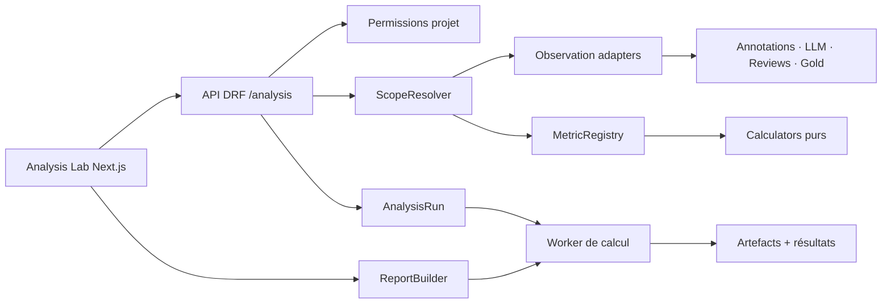

# Pactiva Analysis Lab — dossier de conception technique

**Statut :** architecture cible et socle fonctionnel implémenté
**Date :** 22 juillet 2026
**Route cible :** `/projects/[slug]/analysis`
**Sources :** brief Analysis Lab v2, diagrammes PlantUML fournis, dépôt `claire-studio` au SHA `bc86e04`

## 1. Résumé exécutif

Pactiva Analysis Lab transforme les annotations juridiques en analyses explicables et
actionnables. Il ne s’agit pas d’un tableau de bord BI générique : chaque écran répond à une
question, expose le support statistique, permet de retrouver les cas sources puis d’engager une
action tracée (revue, arbitrage Gold, proposition taxonomique ou rapport).

La chaîne de valeur est la suivante :

```text
question → périmètre figé → observations séparées → métrique versionnée
         → résultat explicable → cas sources → action auditée
```

Le choix d’architecture recommandé est une **couche analytique modulaire dans le monolithe
Django**, et non un second produit ou un data warehouse prématuré. PostgreSQL reste la vérité
métier. Une nouvelle app `claire.analysis` adapte les annotations humaines, pré-annotations LLM,
reviews et Gold vers une projection commune en mémoire. Les calculs légers restent synchrones ;
les calculs lourds et les PDF passent par un worker durable. Le frontend crée une feature autonome
`src/features/analysis` intégrée au shell Pactiva existant.

## 2. Principes non négociables

1. **Provenance visible.** Human, LLM, reviewer, consensus et Gold ne sont jamais confondus.
2. **Sources immuables.** Une analyse ne modifie aucune annotation ; une action crée un objet ou
   une version métier distincte.
3. **Reproductibilité.** Tout résultat référence sa configuration canonique, ses sources, les
   versions des métriques, son schéma et son fingerprint SHA-256.
4. **Explicabilité.** Valeur, dénominateur, support, filtres, avertissements, formule et cas sources
   sont accessibles ensemble.
5. **Protection des annotateurs.** Pas de score opaque ni de classement nominatif par défaut.
6. **Modularité.** Métriques et visualisations sont enregistrées dans des registres typés.
7. **Robustesse.** Jobs idempotents, états persistants, retries bornés, annulation coopérative,
   checksum des artefacts et diagnostic d’erreur.
8. **Sobriété Pactiva.** Navy, surfaces neutres, or rare, tableaux précis, peu d’ombres et aucune
   esthétique « dashboard IA » décorative.

## 3. Carte du système



## 4. Ce qui existe et sera conservé

- Django 5, DRF, PostgreSQL, Redis, API `/api/v1` et conversion snake_case/camelCase ;
- modèles `Project`, `Assignment`, `Annotation`, `Clause`, `ClauseTheme`,
  `AnnotationVersion`, `PreAnnotation`, `PreClause`, `GoldResolution`, `GoldSentence`,
  `GoldRun`, `Review` et `ActivityEvent` ;
- calculs IAA, κ frontières, κ par thème, α MASI, concordance humain–LLM et Gold ;
- Next.js App Router, React Query, Zustand pour préférences locales, MSW, Vitest et Playwright ;
- `AppShell`, `Sidebar`, `TopBar`, `Breadcrumbs`, primitives UI, `Disclosure`, composants Gold ;
- `frontend/design-tokens.json`, thèmes clair/sombre et charte Pactiva ;
- déploiement Git/SSH/systemd, PostgreSQL et Redis du VPS.

## 5. Ce qui doit être créé

- domaine backend `backend/claire/analysis/` ;
- `AnalysisRun`, `AnalysisPreset`, `AnalysisIssue`, `DisagreementCase`, `ReportJob`,
  `ReportArtifact` et éventuellement `TaxonomyProposal` ;
- projection `AnalyticalObservation` non persistée au MVP ;
- `MetricRegistry`, contrats de métriques et catalogue initial ;
- worker durable et stockage d’artefacts ;
- API versionnée `/projects/{slug}/analysis/*` ;
- feature frontend `frontend/src/features/analysis/` ;
- shell analytique, barre de contexte, mode selector, guide, cartes, tableaux et explorateur ;
- registre de visualisations avec alternative tabulaire obligatoire ;
- assistant et moteur de rapport PDF reproductible.

## 6. Modes couverts

| Mode             | Acteurs                       | Exemples de questions                               |
| ---------------- | ----------------------------- | --------------------------------------------------- |
| Individuel       | un humain                     | couverture, certitude, catégories, cycle calendaire |
| Intra-annotateur | même humain, deux versions    | stabilité T1/T2, changements de thèmes/frontières   |
| Inter-humains    | 2 à N humains                 | κ, α MASI, confusion, désaccords                    |
| Humain–LLM       | humains et un modèle          | accord, correction, catégories rares, ancrage       |
| Inter-LLM        | 2 à N modèles/versions        | consensus, entropie, complémentarité                |
| Consensus/Gold   | consensus, reviewer, GoldRuns | provenance et stabilité du Gold                     |

## 7. Organisation du dossier

| Document                                                                                       | Objet                                                          |
| ---------------------------------------------------------------------------------------------- | -------------------------------------------------------------- |
| [01_AUDIT_ET_DECISIONS.md](01_AUDIT_ET_DECISIONS.md)                                           | écarts, réutilisation et décisions d’architecture              |
| [02_PRODUIT_PARCOURS_ET_INFORMATION.md](02_PRODUIT_PARCOURS_ET_INFORMATION.md)                 | personas, navigation et flux                                   |
| [03_MATRICE_EXIGENCES.md](03_MATRICE_EXIGENCES.md)                                             | couverture vérifiable des exigences et gates                   |
| [04_IMPLEMENTATION_SOCLE_SNAPSHOTS_RAPPORTS.md](04_IMPLEMENTATION_SOCLE_SNAPSHOTS_RAPPORTS.md) | état livré, workflow, tests et déploiement sûr                 |
| [05_IMPLEMENTATION_LOTS_AVANCES.md](05_IMPLEMENTATION_LOTS_AVANCES.md)                         | jobs, métriques avancées, Gold, taxonomie, PDF et exploitation |
| [ui-ux/01_SYSTEME_UI_UX.md](ui-ux/01_SYSTEME_UI_UX.md)                                         | interface, ergonomie, graphisme, accessibilité                 |
| [frontend/01_ARCHITECTURE_FRONTEND.md](frontend/01_ARCHITECTURE_FRONTEND.md)                   | routes, composants, état, contrats et performance              |
| [backend/01_ARCHITECTURE_BACKEND.md](backend/01_ARCHITECTURE_BACKEND.md)                       | domaine, services, registres, jobs et rapports                 |
| [database/01_MODELE_DONNEES.md](database/01_MODELE_DONNEES.md)                                 | schéma, indexes, versionnement et rétention                    |
| [metrics/01_CATALOGUE_ET_REGLES.md](metrics/01_CATALOGUE_ET_REGLES.md)                         | formules, supports et limites                                  |
| [api/01_CONTRATS_API.md](api/01_CONTRATS_API.md)                                               | endpoints, enveloppes, erreurs et versioning                   |
| [quality/01_QUALITE_SECURITE_TESTS.md](quality/01_QUALITE_SECURITE_TESTS.md)                   | robustesse, sécurité, performance, QA, observabilité           |
| [reports/01_REPORTING_PDF.md](reports/01_REPORTING_PDF.md)                                     | assistant, moteur et manifeste PDF                             |
| [plan/01_ROADMAP_RISQUES_DECISIONS.md](plan/01_ROADMAP_RISQUES_DECISIONS.md)                   | lots, gates, risques et décisions ouvertes                     |
| [architecture/README.md](architecture/README.md)                                               | diagrammes PlantUML cible                                      |

## 8. Definition of Done produit

Une capacité analytique n’est terminée que si : sa formule et sa version sont documentées ; les
permissions sont testées ; le support et les limites sont visibles ; le résultat est reproductible ;
une table accessible accompagne le graphique ; le drill-down respecte le périmètre ; les états
vide/insuffisant/stale/erreur sont traités ; les budgets de requêtes et de durée sont respectés ;
aucun texte contractuel n’est journalisé ; et les tests unitaires, contrats, composants et E2E sont
verts.
