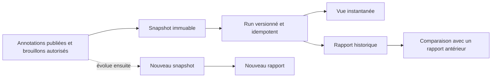

# Socle implémenté — snapshots, analyses et rapports historiques

**Statut :** implémenté sur `codex/analysis-lab-roadmap`
**Date :** 22 juillet 2026
**Périmètre :** première tranche des lots 0, 1, 2 et 5

## 1. Résultat livré

Le module est utilisable avant la fin d’une campagne. L’utilisateur clique sur **Analyser l’état
actuel** : le backend fige les observations visibles à cet instant, y compris les brouillons que
ses droits l’autorisent à consulter. Tous les calculs lisent ensuite exclusivement cette copie.
Une modification ou une publication ultérieure de l’annotation ne modifie donc jamais le résultat
historique.

Un résultat peut être conservé comme rapport. Les rapports restent consultables dans une timeline,
peuvent être archivés sans être supprimés et se comparent au rapport précédent. L’interface affiche
explicitement le nombre de brouillons afin qu’un état provisoire ne soit pas interprété comme une
campagne finalisée.

## 2. Règles de périmètre et de confidentialité

| Profil               | Observations humaines figées                             | Visibilité du snapshot |
| -------------------- | -------------------------------------------------------- | ---------------------- |
| Annotateur           | uniquement ses annotations, brouillons inclus par défaut | personnelle            |
| Reviewer             | ses brouillons et les annotations publiées des autres    | projet                 |
| Lead / owner / admin | toutes les annotations du projet, brouillons compris     | projet                 |

Le paramètre `includeDrafts=false` permet d’exclure explicitement tous les brouillons. Le snapshot
ne contient ni texte de phrase, ni titre de document, ni extrait de preuve, ni rationale, ni nom
d’utilisateur. Les acteurs sont représentés par un pseudonyme HMAC stable dans le projet. Un membre
extérieur reçoit une réponse 404 pour ne pas révéler l’existence d’un projet privé.

Cette première politique est volontairement restrictive. Toute levée future de pseudonymisation
devra faire l’objet d’une permission distincte, d’un événement d’audit et d’une validation métier.

## 3. Garanties de reproductibilité

- `AnalysisSnapshot` stocke manifeste, projection analytique, schéma et fingerprint SHA-256 ;
- le modèle refuse toute sauvegarde après sa création : une évolution crée un nouveau snapshot ;
- la date de capture n’entre pas dans le fingerprint de contenu ; deux captures d’un même état ont
  donc la même empreinte ;
- un `AnalysisRun` référence un snapshot, les codes de métriques et leurs versions ;
- un run réussi de même fingerprint est réutilisé, ce qui rend l’opération idempotente ;
- `AnalysisReport` copie le résultat du run pour une lecture historique immédiate ;
- les créations de snapshots, runs et rapports sont tracées dans l’audit applicatif.

Les sources Django existantes restent la vérité métier. Aucun calcul analytique ne réécrit une
annotation, une pré-annotation LLM ou une décision Gold.

## 4. Composants ajoutés

### Backend

- app `claire.analysis` et migration initiale ;
- modèles `AnalysisSnapshot`, `AnalysisRun`, `AnalysisReport` ;
- `policy.py` pour le périmètre par rôle ;
- `snapshots.py` pour la projection confidentielle et l’empreinte ;
- registre extensible de métriques dans `metrics.py` ;
- orchestration idempotente et comparaison temporelle dans `services.py` ;
- serializers et vues DRF isolés dans l’espace projet.

Métriques v1 livrées : vue d’ensemble et profils pseudonymisés des annotateurs, avec documents
affectés, brouillons/publiés, clauses, validation, couverture, certitude et distribution des thèmes.

### API

Toutes les routes sont sous `/api/v1/projects/{slug}/analysis` :

| Méthode et route            | Usage                                               |
| --------------------------- | --------------------------------------------------- |
| `GET /catalog`              | catalogue et versions des métriques                 |
| `GET/POST /snapshots`       | historique ou capture de l’état visible             |
| `GET /snapshots/{id}`       | détail et manifeste d’une capture autorisée         |
| `GET/POST /runs`            | historique ou calcul depuis un snapshot             |
| `GET /runs/{id}`            | état et résultat d’un calcul                        |
| `GET/POST /reports`         | historique ou conservation d’un run réussi          |
| `GET/PATCH /reports/{id}`   | lecture, renommage ou archivage par le propriétaire |
| `GET /reports/{id}/compare` | delta avec le précédent ou `?against={id}`          |

### Frontend

La route `/projects/{slug}/analysis` est accessible depuis la barre latérale. Elle fournit :

- une action unique de capture et d’analyse de l’état courant ;
- un avertissement permanent sur le caractère provisoire des brouillons ;
- les KPI et la table accessible des profils pseudonymisés ;
- l’enregistrement d’un résultat comme rapport ;
- une timeline paginée de rapports avec sélection instantanée, deltas et archivage ;
- les états vide, chargement et erreur, dans les composants et tokens Pactiva existants.

## 5. Validation exécutée

| Gate                                 | Résultat                                       |
| ------------------------------------ | ---------------------------------------------- |
| tests ciblés backend Analysis Lab    | 6 réussis                                      |
| suite backend complète               | 438 tests attendus après le test d’immuabilité |
| tests ciblés frontend                | 3 réussis                                      |
| suite frontend complète              | 525 réussis                                    |
| Ruff, Django check, migrations check | réussis                                        |
| TypeScript `tsc --noEmit`            | réussi                                         |
| build Next.js de production          | réussi, route dynamique générée                |

Les tests couvrent notamment : brouillon non publié, absence de fuite d’un pair, différence de
droits lead/reviewer, stabilité du fingerprint, indépendance aux modifications postérieures,
immutabilité du snapshot, historique et delta, workflow API et isolation d’un utilisateur externe.

## 6. Déploiement sans risque pour la base de production

La migration est **expand-only** : elle crée trois tables et leurs index, ajoute l’app Django et ne
modifie aucune table métier existante. Malgré cela, elle ne doit pas être lancée directement sans
répétition sur une copie ou un staging et sans sauvegarde PostgreSQL vérifiée.

Ordre de release recommandé :

1. revue puis merge de la branche vers `main` via GitHub ;
2. sauvegarde PostgreSQL horodatée et test de restauration ;
3. répétition de `manage.py migrate --plan` puis de la migration sur staging ;
4. vérification que l’ancien code fonctionne encore avant migration ;
5. exécution de `./deploy/deploy-claire.sh --allow-migrations` depuis un worktree propre ;
6. contrôle des deux services systemd, de `/api/v1/health` et de la page d’accueil ;
7. smoke authentifié : catalogue, création d’un snapshot personnel, run, rapport, relecture ;
8. surveillance des erreurs, latences et volumes de tables avant élargissement.

Le script refuse par défaut une migration et exige `--allow-migrations`. Son rollback remet le code
précédent mais ne rétrograde pas le schéma ; c’est volontaire pour une migration additive. Aucun
déploiement production n’est réalisé dans ce lot tant que la PR, la sauvegarde et la répétition
staging n’ont pas été explicitement validées.

## 7. Écarts restant à traiter dans les lots suivants

Le socle ne constitue pas encore l’ensemble du laboratoire cible. Restent notamment :

- dispatcher Celery/Redis, reprise et progression pour les calculs lourds ;
- scope preview, presets et filtres avancés ;
- métriques inter/intra-annotateurs, humain–LLM, inter-LLM et matrices de désaccord ;
- drill-down vers les cas sources sans exposer de brouillons non autorisés ;
- comparaison taxonomique et Gold multi-runs ;
- génération PDF, artefacts privés, checksum, quota et rétention ;
- benchmarks ORM/charge, observabilité du worker et procédures de purge.

Ces extensions se branchent sur les contrats déjà livrés : nouvelle métrique dans le registre,
nouvelle version dans le fingerprint, puis nouveau composant de visualisation sans modifier les
snapshots ou rapports historiques.
